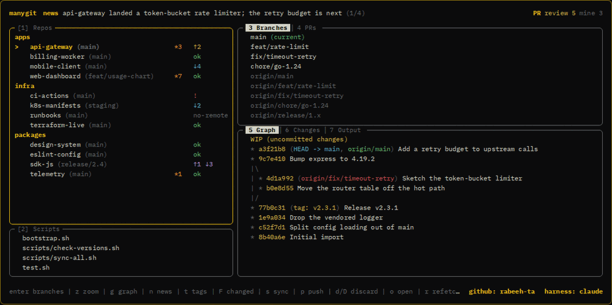

# manygit

A lazygit-style terminal UI for a whole **tree** of git repos. Point it at a
folder and every repo underneath is on one screen: its branch, and whether it's
ahead / behind / dirty. Fetch, pull, push, or switch branches on the one under
the cursor — plus a commit graph, a script runner, and a GitHub pull-request pane
(when the `gh` CLI is installed).



<sub>Or **[try the real interface in your browser](https://rabeeh-ta.github.io/manygit/)** — the
landing page runs a working port of the TUI. The git is fake; the keys are the
real keys.</sub>

## Install

macOS / Linux:

```bash
curl -fsSL https://raw.githubusercontent.com/rabeeh-ta/manygit/main/install.sh | bash
```

This drops `manygit` into `~/.local/bin` (adding it to your PATH if needed), so
you can run `manygit` from anywhere. On each launch it checks for a newer release
and offers to update itself.

<details>
<summary>From source (needs Go 1.24+)</summary>

```bash
git clone https://github.com/rabeeh-ta/manygit && cd manygit
go build -o ~/.local/bin/manygit .
```
</details>

## Usage

```bash
manygit                 # scan the current directory
manygit --root ~/work   # scan a specific folder
```

manygit walks the folder (depth 3) for git repos and groups them by parent.

`manygit stats` prints public download counts from GitHub (total releases,
all-time downloads split by OS, and the last 10 tags) — no auth, no telemetry,
just aggregate numbers GitHub already keeps. Anyone can run it.

## Keys

Actions apply to the **highlighted** repo (the `>` cursor).

| Key | Action |
|---|---|
| `1` `2` `3` | focus Repos / Scripts / Branches |
| `4` | PRs — a tab beside Branches (top-right) |
| `5` `6` `7` | bottom slot: Graph / Changes / Output |
| `tab` / `shift+tab` | cycle the panes forwards / backwards |
| `[` / `]` | cycle the focused pane's tabs (3⇄4, 5→6→7) — the numbers still jump straight there |
| `j` `k` | move within the focused panel |
| `→` `←` | hop between Repos and Branches |
| `m` | in the PRs tab: toggle *my PRs* ⇄ *review requests* |
| `enter` | Repos → view branches · Branches → checkout · Scripts → run · PRs → checkout the PR's branch |
| `b` | checkout the highlighted branch — what `enter` does in Branches, from any pane |
| `s` / `p` | sync (fetch + ff-pull) / push the highlighted repo |
| `d` / `D` | discard changes (confirm): `d` tracked only · `D` also deletes untracked files |
| `f` / `r` | fetch one / refetch all |
| `g` | full-screen commit graph |
| `n` | full-screen news feed — all headlines at once (AI-summarized, cached ~4h) |
| `t` | toggle each repo's latest tag inline, after the branch (off by default) |
| `F` | show only repos with changes / ahead / behind |
| `/` | filter the focused list by what it shows — repos match on name **and** current branch (`/master` finds every repo on master, and the tag too while `t` is on); branches match on name (type `feat` to find a remote branch among hundreds); scripts on name |
| `o` | open the repo in your editor |
| `z` | zoom the focused pane |
| `esc` | back out one layer of state: the diff, then Changes, then zoom, then the `/` and `F` filters |
| `?` | keybindings & the status legend |
| `,` | settings (themes, AI harness, news window, scan depth, glyphs, editor) |
| `q` | quit |

Status column: `ok` up to date · `↑N` ahead · `↓N` behind · `*N` dirty ·
`no-remote` local-only repo (never pushed anywhere — `s`/`p` skip it) · `!` the
branch has no upstream, or git errored. Set `status_glyphs: ascii` (in config or
`,`) if the arrows misalign.

## GitHub PRs (tab `4`, beside Branches)

If the [`gh` CLI](https://cli.github.com) is installed and signed in
(`gh auth login`), manygit adds a **PRs** tab next to Branches in the top-right
slot (press `4`; `3` switches back to Branches) and shows `github: <user>` next
to the harness in the footer. The tab lists two sets, toggled with `m`:

- **mine** — your open pull requests
- **review requests** — PRs waiting on *your* review

Each row shows the repo, title, and author. A compact count of both appears at the
right end of the top bar. Use `/` to filter and `j`/`k` to move, like every other
list. Press `enter` on a PR to **check out its branch** in the matching local
clone (matched by the origin remote) — manygit runs `gh pr checkout`, which
handles forks and tracking, and then jumps you to that repo's Branches so you can
review right away. It only checks out when the repo is in view and its working
tree is clean; otherwise it says why. `r` refreshes the PR lists along with the
repos.

Needs `gh` 2.12+ (for `gh search prs`). Without `gh`, the pane simply shows a
hint and the top-bar/footer GitHub bits are omitted.

## Config (optional)

`~/.config/manygit/config.yml` (also written by the `,` settings screen):

```yaml
max_depth: 3            # folders below the root to search for repos (1–5 in `,`)
open_cmd: code          # `o` runs this in the repo: code | cursor | code -r | code .
theme: default          # default | serika_dark | dracula | nord | catppuccin | 8008
status_glyphs: unicode  # or "ascii"
```

`max_depth` is also a setting in `,` — picking a depth re-walks the tree straight
away, no restart. A depth with no repos under it is refused (manygit won't start
on an empty tree, so it won't drop you into one either) and you keep the depth you
had.

`open_cmd` is the editor command as you'd type it in the repo — manygit adds the
folder itself (a trailing `.` is fine). If it can't open, `o` now says why
(e.g. `code` not on PATH). Over SSH, `code`/`cursor` can only reach your editor
through its Remote-SSH server: manygit finds that server's socket automatically,
so `o` works from a plain terminal too **as long as an editor window is connected
to the machine** — otherwise there's nothing to open into.

manygit never writes to the folder you launch from, and never force-pushes,
merges, or rebases. The only destructive action is discarding a repo's changes
(`d` / `D`), which always asks you to confirm first.

## Releasing (maintainer)

Cut a release by pushing a version tag — GitHub Actions builds the binaries and
publishes the release; the installer and self-updater pick it up automatically:

```bash
git tag v0.2.0
git push origin v0.2.0
```

The version is taken from the tag; nothing in the code needs editing.

The release's **notes become the in-app changelog**: after someone updates
through the built-in updater, manygit fetches the recent releases from the GitHub
API and shows what changed — once, scrollable with `j`/`k`, `esc` to continue. It
is never packaged into the binary. `.goreleaser.yaml` groups the commits into
Features / Fixes from their `feat:` / `fix:` prefixes, so write those and the
changelog writes itself. A fresh install or `go install` never sees the screen —
only an update through the updater triggers it.
